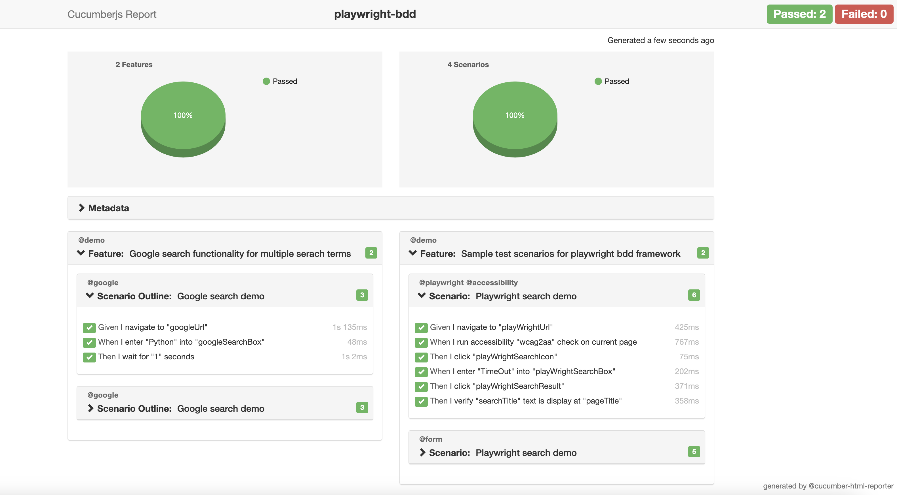

# 🎭Playwright based keyword driven framework using BDD Cucumber

Playwright BDD is test automation framework that utilizes Behavior Driven Development (BDD) with Cucumber and Playwright. It includes scenarios that are created using the keywords and Page Object Pattern do perform automated UI(Web) and Accessibility testing. The project supports env agnostic execution with segrated test data and content for each environment and provide detailed Cucumber HTML Report for each execution.

### **Benefits: Playwright BDD Test Automation Framework**

* BDD Enabled: Supports Behavioral Driven Development using cucumber tests written in Given, When,Then format for Functional UI Testing.
* Page Object Model: Scalable POM implementation with Test Object Repository and Custom Keywords to increase the maintainability and reusability.
* Tests are less flaky due to inbuilt auto-wait features supported by the framework
* Readily captures screenshots of the Test Execution
* As per requirement, Parallel execution is feasible
* Easy to set with very few dependencies
* Organised structurally for Test files, Test Data, Environment variables and Utilities
* Supports both functional and accessibility automation without any additional setup
* Pre-Defined keywords for ease of implementation and reuse

### Global Assertions and Hooks

The project also includes global assertions and hooks, making it easier to perform tasks before and after each scenario. This ensures that each scenario is executed consistently and efficiently, with the same setup and teardown process for each test case.

### Cucumber HTML Reporter

The project features a visually appealing Cucumber HTML Reporter t. The reporter presents the results of each scenario in an easy-to-read format, making it simple to understand the test results and identify any issues that need to be addressed.



## 👨‍🔧 Getting Started :

To start using this framework we need to consider the following steps:

###Pre-Requisites:
* NodeJS
* IDE as per the Preference

ℹ️ Clone or download the project from GitHub.

**1. After cloning the repo we will to install all dependency but executing below command from the project root:**
```shell
npm i
```

**2. Run all tests for specific env and create html report but executing below script from the project root:** 
```shell
npm run run-dev-env-all
npm run run-int-env-all
```
**3. Run tests with specific tag and create html report:**
```shell
npm run run-test-by-tag
```

##Insight on Project and its Folder structure:
Under the playwright BDD Project Folder:
* /features |  This folder is used to place all the Test files as Cucumber Feature files
* /locators |  This folder is used to store all locators for all different locator type ( Syntax followed: locatorType + locatorValue)
* /node_modules | This folder is used to save all downloaded packages from NPM in your computer for the JavaScript project. And it is recommended to do a fresh install with npm install as the project is downloaded
* /output | This folder is used to store cucumber execution json reports and also has 2 sub folders html-reports and screenshots
* /output/html-reports | This folder is used to store latest execution cucumber html reports which can be viewed in any browser of choice
* /output/screenshots | This is used to store the screenshots captured during the test executions
* /pages | This folder is used to write reusable function for each action and verifications
* /setup | This folder is mainly used to write any reusable utility or setup commands for an framework support
* /step-definitions | This folder contains Steps definitions for each of the feature files has mapping of BDD keywords to Page folder functions
* /test-data | This folder is used to store test data with different yaml file for each environment we want to run test against.
* /cucumber.js | This file is used to maintain all setting for cucumber js (Including feature & step defs location)
* /reporter.js | This file is used to maintain all setting for cucumber html report generation (Including reports path and metadata)
* /package-lock.json | This file is automatically generated for any operations where npm modifies either the node_modules tree, or package.json, to internally resolve the tree of dependencies.
* /package.json | This file contains the core content of the project as a reference to all its properties as well as dependencies


### **Want to Contribute | Contact :**
>Please reach out to  [Prashant Kumar](prashant201984@gmail.com)

